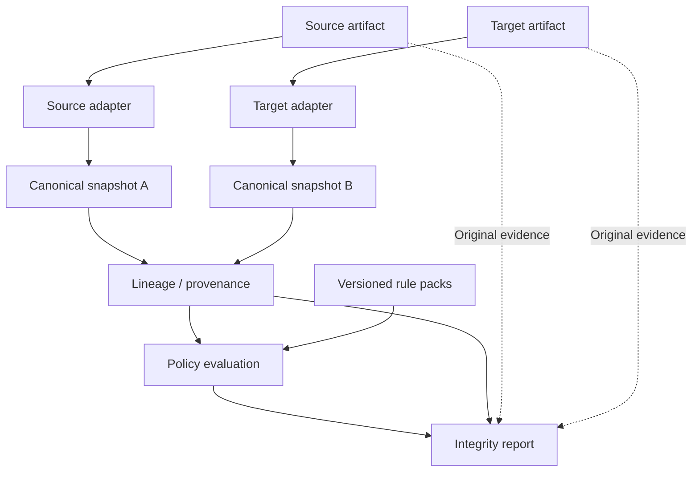

# Payment Journey


Trace what happens to payment data as it moves between formats—and identify where meaning is preserved, transformed, degraded, or lost.

## Why this exists

Message validation asks whether an artifact follows a syntax or profile. Payment data integrity asks whether the meaning survived the transformation. Two individually valid messages can still disagree about a payment or lose structure between them. The illustration below is semantic, not a claim that particular messages pass a schema or network profile.

## What it does

Payment Journey is being designed to compare evidence from two artifacts representing the same synthetic payment:

```text
MT103
   ↓
Canonical Snapshot
   ↓
Semantic Lineage
   ↑
Canonical Snapshot
   ↑
pacs.008
```

The planned engine explains preservation, normalization, structuring, derivation, collapse, misplacement, truncation, loss, and unexplained additions. Events compose: information can survive while its structure degrades. These are planned capabilities; no executable analyzer is included yet.

## Example finding

Fictional semantic test data, not a real party or transaction:

```text
Source                          Target
BuildingNumber = 1200           StreetName = "1200 BRICKELL AVE STE 900"
StreetName = BRICKELL AVE
Room = STE 900
```

**Information: preserved. Structure: collapsed. Placement: partially misplaced.**

The building number and room still appear, but inside a street-name element. A character comparison could miss this degradation. The lineage engine records what happened; a separately selected policy decides whether to warn or fail. This structured-source example is a canonical-model test, not a claim that MT103 supplies these discrete fields.

## Core principles

> Nothing disappears. Nothing appears without explanation.

- Validation is not integrity. Explain findings, rather than merely scoring them.
- Preserve provenance and the original artifacts. Never silently repair or infer.
- Never discard semantic information the source already knows.
- Keep facts separate from policy, and keep unknown data visible.
- Use synthetic data only. Canonical representation does not confer standards authority.

## MVP scope

**Available now:** product definition, six accepted ADRs, domain and adapter contracts, fixture specifications, acceptance criteria, source register, and an open technical proposal.

**Planned for v0.1:** a supported synthetic MT103/pacs.008 pair; debtor and creditor names, useful account references, and postal addresses; deterministic bidirectional lineage; inspectable evidence; visible unmapped data; and a small cited public baseline policy pack.

**Not implemented:** parsers, lineage engine, policy pack, UI, executable fixtures, or application CI. Supported message versions and field options remain open. No installation or run command exists yet. See [MVP definition](docs/product/mvp-definition.md) and [non-goals](docs/product/non-goals.md).

## Architecture



A payment is not a message. Each artifact is evidence from one stage; its canonical snapshot is an interpretation. [Architecture overview](docs/architecture/overview.md).

## Rule packs

Lineage answers “what happened?” Policy answers “is it acceptable under this selected regime?” Future profiles may combine public semantic rules, network requirements, market practice, institution policies, and vendor baselines. Vendor behavior does not establish what should happen. Saved evaluations must retain the exact rule versions used.

No network conformance is claimed today. [Policy model](docs/domain/policy-engine.md) · [Redistribution boundaries](docs/research/licensing-boundaries.md).

## Documentation

Start at the [documentation index](docs/index.md), then explore [discovery](docs/product/problem-discovery.md), [taxonomy](docs/domain/evaluation-taxonomy.md), [canonical model](docs/domain/canonical-payment-model.md), [decisions](docs/governance/decision-log.md), [research sources](docs/research/source-register.md), and [technical proposal](docs/architecture/technical-stack-proposal.md).

## Roadmap

| Phase | Focus | State |
| --- | --- | --- |
| 0 | Product definition and repository bootstrap | Documentation drafted |
| 1 | MT103 / pacs.008 address MVP | Planned; decisions open |
| 2 | Rule-pack expansion | Future |
| 3 | More participant roles | Future |
| 4 | More message families | Future |
| 5 | Multi-hop journeys | Future hypothesis |
| 6 | Regression / CI integration for users | Future hypothesis |

Project engineering CI belongs in Phase 1; Phase 6 concerns downstream user workflows. No delivery dates are committed. [Implementation plan](docs/architecture/implementation-plan.md).

## Project status

This is an early public portfolio project intended for open-source release, under active development. The working name is Payment Journey. **License selection is OPEN; an open-source license has not yet been granted.** See [LICENSE](LICENSE) and [open questions](docs/governance/open-questions.md). Discovery confidence inherited from the handoff is distinguished from independently verified evidence.

## Contributing

Payments practitioners, developers, QA engineers, standards specialists, and product managers can help refine the scope, challenge assumptions, and review fictional examples. Start with [CONTRIBUTING.md](CONTRIBUTING.md). Submit only material you are entitled to share; do not contribute employer or customer information.

## Disclaimer

Payment Journey is a standards-analysis and engineering-support project. It is not legal or regulatory advice, does not replace authoritative network documentation, and must not be used to initiate or authorize payments. Every example is synthetic. See [DISCLAIMER.md](DISCLAIMER.md).
