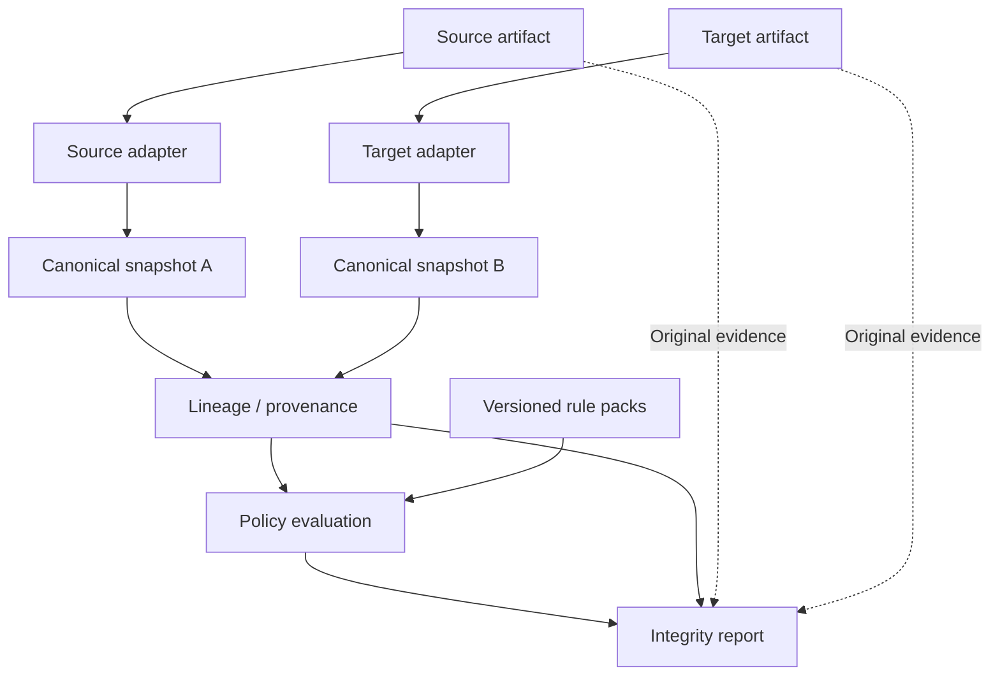

# Payment Journey

**Status: preservation and fidelity-degradation slices implemented · full MVP in development**

Trace what happens to payment data as it moves between formats—and identify where meaning is preserved, transformed, degraded, or lost.

## Why this exists

Message validation asks whether an artifact follows a syntax or profile. Payment data integrity asks whether the meaning survived the transformation. Two individually valid messages can still disagree about a payment or lose structure between them. The illustration below is semantic, not a claim that particular messages pass a schema or network profile.

## What it does

Payment Journey compares evidence from an explicitly paired synthetic MT103 subset and pacs.008.001.14:

```text
MT103
   ↓
Canonical Snapshot
   ↓
Semantic Lineage
   ↑
Canonical Snapshot
   ↑
pacs.008
```

The engine identifies preservation, collapse, misplacement, truncation, loss and unsourced additions. Fixture A uses the supported raw payment pair; bundled canonical witnesses C/D/E/F/J supply explicit evidence for degradation. Raw non-matches remain unresolved without sufficient evidence. Events compose: information can survive while its structure degrades.

## Example finding

Implemented Fixture D, selectable in the demo after Fixture A. These are fictional canonical evidence records, not a real party or transaction:

```text
Source                          Target
BuildingNumber = 1200           StreetName = "1200 BRICKELL AVE STE 900"
StreetName = BRICKELL AVE
Room = STE 900
```

**Information: preserved. Structure: collapsed. Placement: partially misplaced.**

| Source concept | Implemented events |
| --- | --- |
| BuildingNumber | PRESERVED, COLLAPSED, MISPLACED |
| StreetName | PRESERVED, COLLAPSED |
| Room | PRESERVED, COLLAPSED, MISPLACED |

The three relationships share one group and target value, with separate component evidence. The building number and room survive inside the wrong semantic element. This canonical witness does not imply MT103 supplies discrete fields. The engine reports observations; policy evaluation remains planned.

## Core principles

> Nothing disappears. Nothing appears without explanation.

- Validation is not integrity. Explain findings, rather than merely scoring them.
- Preserve provenance and the original artifacts. Never silently repair or infer.
- Never discard semantic information the source already knows.
- Keep facts separate from policy, and keep unknown data visible.
- Use synthetic data only. Canonical representation does not confer standards authority.

## MVP scope

**Implemented:** browser-local Fixture A through the block-4-only MT103 Option-F and single-transaction pacs.008.001.14 adapters; React-independent canonical snapshots; six composable events; grouped component relationships; raw locators and evidence; omitted suffixes; directional loss/origin observations; explicit unknown/unresolved coverage. Fixture A preserves ten relationships. Bundled canonical fixtures C/D/E/F/J demonstrate degradation with explicit correspondence and complete finite evidence where absence is asserted. No discrete MT address structure is inferred.

**Roadmap:** normalization, structuring, derivation, alteration, duplication, conflicts and other taxonomy classifiers; broader address interpretation; policy evaluation and a versioned authoritative public baseline pack following separate evidence review.

**Not implemented:** policy evaluation, full MT/XSD validation, network-profile conformance, export/import, a backend, or a database. Payloads stay in browser memory during analysis. See [parser boundaries](docs/architecture/parser-contract.md), [MVP definition](docs/product/mvp-definition.md), and [non-goals](docs/product/non-goals.md).

### Run the fictional demo

Use Node.js **24.21.0 LTS** (pinned in `.nvmrc`) and npm:

```sh
npm ci
npm run build
npm run preview
```

Open the printed localhost URL, then select **Evaluate explicit pair**. Fixture A is preloaded. Choose **Fixture D** in the demonstration selector to inspect collapse and selective misplacement, or C/E/F/J for the other cases. All parties, accounts, identifiers, institutions and payments are fictional. No secrets or credentials are needed.

```sh
npm run check
npx playwright install chromium
npm run test:browser
```

`npm run dev` is available for local editing. Production preview uses restrictive CSP; the development server permits localhost HMR traffic and style injection. Browser privacy tests target the production build. A static host is not selected or deployed.

## Architecture



A payment is not a message. Each artifact is evidence from one stage; its canonical snapshot is an interpretation. [Architecture overview](docs/architecture/overview.md).

## Rule packs

Lineage answers “what happened?” Policy answers “is it acceptable under this selected regime?” Future profiles may combine public semantic rules, network requirements, market practice, institution policies, and vendor baselines. Vendor behavior does not establish what should happen. Saved evaluations must retain the exact rule versions used.

No network conformance is claimed today. [Policy model](docs/domain/policy-engine.md) · [Redistribution boundaries](docs/research/licensing-boundaries.md).

Verification: [second-slice results and limitations](docs/quality/second-slice-verification.md).

## Documentation

Start at the [documentation index](docs/index.md), then explore [discovery](docs/product/problem-discovery.md), [taxonomy](docs/domain/evaluation-taxonomy.md), [canonical model](docs/domain/canonical-payment-model.md), [decisions](docs/governance/decision-log.md), [research sources](docs/research/source-register.md), and [accepted implementation gate](docs/architecture/implementation-gate.md).

## Roadmap

| Phase | Focus | State |
| --- | --- | --- |
| 0 | Product definition and repository bootstrap | Bootstrap complete |
| 1 | MT103 / pacs.008 address MVP | Preservation and degradation slices implemented |
| 2 | Rule-pack expansion | Future |
| 3 | More participant roles | Future |
| 4 | More message families | Future |
| 5 | Multi-hop journeys | Future hypothesis |
| 6 | Regression / CI integration for users | Future hypothesis |

Project engineering CI belongs in Phase 1; Phase 6 concerns downstream user workflows. No delivery dates are committed. [Implementation plan](docs/architecture/implementation-plan.md).

## Project status

This is an early public portfolio project intended for open-source release, under active development. The working name is Payment Journey. **License selection is OPEN; an open-source license has not yet been granted.** See [LICENSE](LICENSE) and [open questions](docs/governance/open-questions.md). Discovery confidence inherited from the handoff is distinguished from independently verified evidence.

## Contributing

Payments practitioners, developers, QA engineers, standards specialists, and product managers can help refine the scope, challenge assumptions, and review fictional examples. Start with [CONTRIBUTING.md](CONTRIBUTING.md). Submit only material you are entitled to share; do not contribute employer or customer information.

## Disclaimer

Payment Journey is a standards-analysis and engineering-support project. It is not legal or regulatory advice, does not replace authoritative network documentation, and must not be used to initiate or authorize payments. Every example is synthetic. See [DISCLAIMER.md](DISCLAIMER.md).
