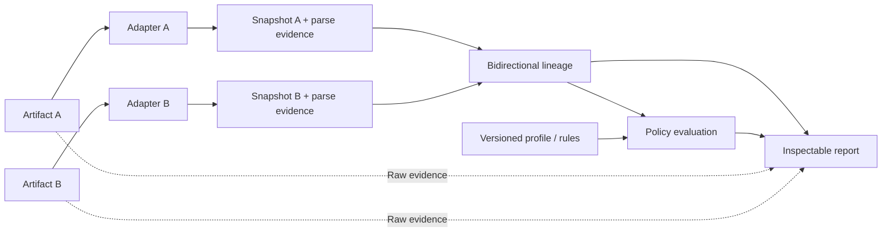

# Architecture overview

STATUS: Preservation and fidelity-degradation slices implemented. Adapters, canonical snapshots, lineage observations and browser UI exist. A first versioned public address-quality pack evaluates immutable lineage separately; network/institution profiles remain planned.

A PaymentJourney holds artifacts, their interpretations, transformations, and the provenance graph. Adapters interpret each family into common semantics; they never translate directly between payment formats. The canonical model serves comparison, not standards authority.

## Boundaries

| Layer | Owns | Must not own |
| --- | --- | --- |
| Artifact ingestion | Original evidence and metadata | Silent normalization or data loss |
| Adapters | Parsing, interpretation evidence, unmapped elements, warnings | Severity or compliance |
| Domain | Format-neutral concepts and identities | Format-specific parsing/UI state |
| Lineage | Correspondences and composable observations | Policy acceptability |
| Policy | Versioned applicable judgments | Mutation of evidence or lineage |
| Report/UI | Inspection and transparent coverage | Hidden repair or invented provenance |

The [stack proposal](technical-stack-proposal.md) suggests a modular implementation without requiring separate services. A [source-code plan](implementation-plan.md) sequences only the frozen MVP. A graph model does not require graph infrastructure.
